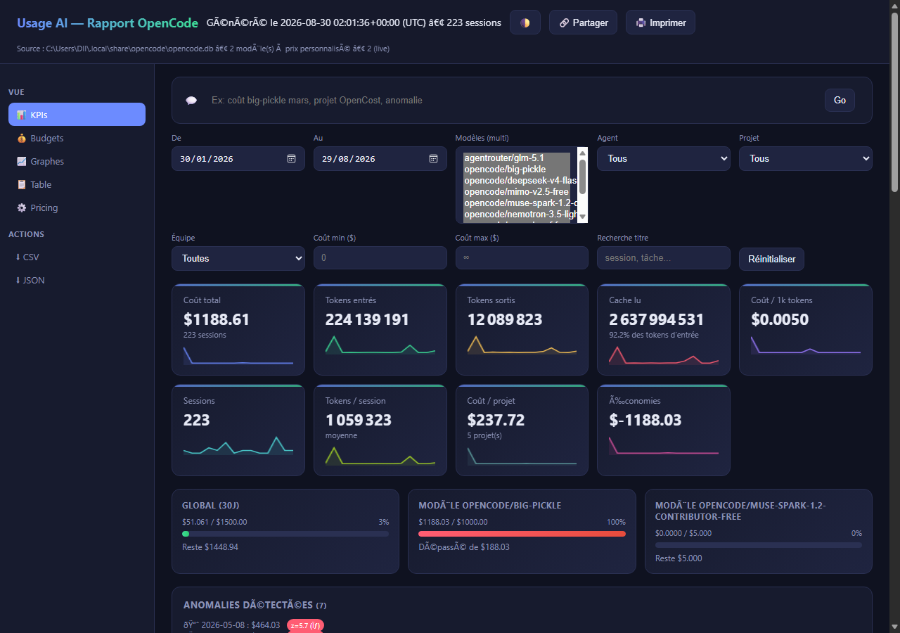

# Usage AI : rapport hors-ligne des sessions OpenCode



Extrait l'utilisation des modèles IA depuis la base **locale** d'OpenCode
(`opencode.db`, SQLite) et génère un rapport visuel **100 % hors-ligne** :
un fichier HTML unique, ouvrable par double-clic, avec filtres,
graphes et personnalisation des coûts par modèle.

## Prérequis

- Python 3.10+ (stdlib uniquement, **aucun `pip install`**)
- OpenCode ayant des sessions enregistrées (chemin par défaut ci-dessous)

Base de données par défaut :

- Windows : `%USERPROFILE%\.local\share\opencode\opencode.db`
- macOS/Linux : `~/.local/share/opencode/opencode.db`

## Utilisation rapide

```powershell
python extract.py            # 1. extrait les sessions (delta incrémental)
python build_report.py       # 2. génère dist/report.html
start dist\report.html       # 3. ouvre le rapport (hors-ligne)
```

Ou tout-en-un :

```powershell
python extract.py --full ; python build_report.py --strict ; start dist\report.html
```

Si `make` est disponible : `make report`, `make open`, `make all`.

## Commandes `extract.py`

| Commande | Effet |
|---|---|
| `python extract.py` | extraction incrémentale (depuis le dernier sync) |
| `python extract.py --full` | ré-extraction complète (après modification de `config/pricing.json`) |
| `python extract.py --db <chemin>` | base OpenCode personnalisée |
| `python extract.py --watch` | surveille `opencode.db` (watchdog si dispo, sinon poll) et re-extrait |
| `python extract.py --watch --build` | idem + régénère `dist/report.html` |

Variable d'environnement : `OPENCODE_DB` (chemin vers la base).

## Personnalisation des coûts par modèle

Éditez `config/pricing.json` — prix pour **1 million de tokens (USD)** ;
la clé est `providerID/modelID` :

```json
{
  "models": {
    "opencode/big-pickle": {
      "input_per_1M": 2.5,
      "output_per_1M": 10.0,
      "cache_read_per_1M": 1.0,
      "cache_write_per_1M": 2.5
    }
  }
}
```

- Un modèle **absent** de la liste garde le coût **calculé par OpenCode**.
- Après édition : `python extract.py --full ; python build_report.py`.
- Dans le rapport, le panneau « Personnaliser les coûts » est **live** : la saisie recalcule instantanément KPIs/graphes/table, sauvegarde un brouillon `localStorage` et `Exporter pricing.json` télécharge le fichier (remplacer `config/pricing.json` puis `--full` pour pérenniser). Bouton 🌓 thème clair/sombre.
- `python build_report.py --external` : `dataset.json` externe (fetch) pour gros volumes (>10k sessions) au lieu d’inline.

## Le rapport (`dist/report.html`)

- KPI : coût total, tokens entrés/sortis, cache, coût/1k tokens, sessions
- Graphes : coût & tokens/jour par modèle, donut coût par modèle,
  coût par agent, histogramme coût/session, ratio cache
- Filtres : plage de dates, modèles (multi), agent, projet, coût min/max, recherche
- Table détaillée triable (pagination 100, `aria-live`) + export CSV/JSON (live)
- Aucun appel réseau au chargement (sauf `--external`) : Chart.js et données inlinés
- `make test` : `py_compile` + `unittest` (7 tests) ; CI GitHub Actions

## Structure

```
config/pricing.json      # coûts personnalisés par modèle (éditable)
data/dataset.json        # données agrégées (générées, non versionnées)
data/sync_state.json     # état du sync incrémental (généré)
assets/chart.umd.min.js  # Chart.js embarqué au build (offline)
extract.py               # lecture opencode.db -> dataset.json
build_report.py          # dataset.json -> dist/report.html
dist/report.html         # rapport final, unique et hors-ligne
```
